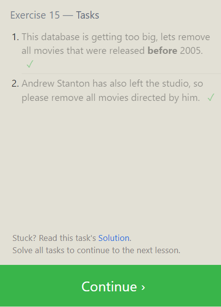

## SQL Practice

SQL (Structured Query Language) is designed to allow both technical and non-technical users to query, manipulate, and transform data from a relational database.

### Summary of Relational Databases

- **Structure**: Data is organized into tables, each representing a specific entity or concept, such as customers, products, or orders.

- **Tables**: Comprised of rows and columns, where rows represent individual instances of the stored entity, and columns represent attributes or properties.

- **Relationships**: Tables are related through common fields or keys, facilitating complex data relationships, like linking customers to orders.

- **Data Integrity**: Enforced through mechanisms such as primary keys, foreign keys, and constraints to ensure accuracy, consistency, and reliability.

- **Query Language**: SQL is used to interact with relational databases, offering a standardized way to perform operations such as querying, inserting, updating, and deleting data.

- **Normalization**: Involves organizing data into multiple tables to reduce redundancy and improve efficiency.

- **Scalability and Performance**: Relational databases scale to handle large data volumes efficiently, designed for optimal querying and data retrieval.

### Screenshots

- Exercise 1 

- Exercise 2 

- Exercise 3 

- Exercise 4 

- Review Task 1 

- Exercise 6 

- Exercise 7 

- Exercise 8 

- Exercise 9 

- Exercise 10 

- Exercise 11 

- Exercise 12 

- Exercise 13 

- Exercise 14 

- Exercise 15 

- Exercise 16
 
- Exercise 17
 
- Exercise 18 

- The End
